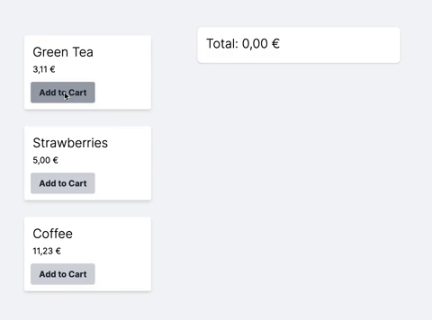

# Technical Assignment

> *You are the developer in charge of building a cash register. This app will be able to add products to a cart and display the total price. Build an application prototype responding to these needs.*
> | *Product code* | *Name*         | *Price*   |
> | -------------- | -------------- | --------- |
> | *GR1*          | *Green Tea*    | *3.11 €*  |
> | *SR1*          | *Strawberries* | *5.00 €*  |
> | *CF1*          | *Coffee*       | *11.23 €* |
> ### *Special conditions*
> * *The CEO is a big fan of buy-one-get-one-free offers and green tea. He wants us to add a rule to do this.*
> * *The COO, though, likes low prices and wants people buying strawberries to get a price discount for bulk purchases. If you buy 3 or more strawberries, the price should drop to 4.50€.*
> * *The VP of Engineering is a coffee addict. If you buy 3 or more coffees, the price of all coffees should drop to 2/3 of the original price.*
> *Our check-out can scan items in any order, and because the CEO and COO change their minds often, it needs to be flexible regarding our pricing rules.*
> ### *Test data*
>| *Basket*                  | *Total price expected* |
>| ------------------------- | ---------------------- |
>| *GR1, SR1, GR1, GR1, CF1* | *22.45€*               |
>| *GR1, GR1*                | *3.11€*                |
>| *SR1, SR1, GR1, SR1*      | *16.61€*               |
>| *GR1, CF1, SR1, CF1, CF1* | *30.57€*               |

## Solution

### Purpose
My goal was to build a clean code that meets assignment requirements, and it is open to change when company management changes their minds.

### Preconditions
When building a shopping cart for large-scale applications where performance and resources are crucial, usually, we want to offload the cart state to the frontend. In reality, that means implementing cart logic on both frontend and backend, which increases codebase complexity. Due to the very limited time I could spend on this assignment, I chose a database to hold shopping cart data. It is the least performant approach but the simplest one to implement with Ruby on Rails.

### Domain modeling
`Product` model presents all products available in a store  
`Cart` model holds cart data for current customer  
`Cart::LineItem` model presents product added to a cart  
`Offer` model holds data about special conditions that company management invented  
`Offer::BuyOneGetOneFree` is the CEO's rule to add a product for free  
`Offer::FixedBulkDiscount` is the COO's rule to discount price to a fixed amount for bulk purchases  
`Offer::VariableBulkDiscount` is the VP of Engineering's rule to discount 2/3 of the price for bulk purchases  
`Bargain` is a line item with a special offer applied

I modeled the domain with flexibility for changing offers in mind. The behavior of the offers can be easily changed by editing the corresponding file without the interruption of shopping cart functionality. Even adding a new offer to the shop doesn't require changing the implementation of the shopping cart. Because of the organized file structure, we just need to add `Offer::NewOfferName` model in the `/model/offer` folder and associate the offer to a product.

### Business logic
I extracted business logic into a pattern named Activities. Activity is a plain old Ruby object that performs business logic. It is similar to a more famous Service object pattern, but I like to keep Services reserved for integrations with external systems. In addition, the isolation of business logic into smaller units provides an easier way for writing tests.

`ShoppingCart::AddLineItemActivity` adds line item to cart and updates bargains. When a line item is already in a cart, it will increase the quantity  
`ShoppingCart::RemoveLineItemActivity` removes line item from cart  
`ShoppingCart::CalculateTotalActivity` recalculate total amount for cart  
`ShoppingCart::LineItem::IncreaseQuantityActivity` increases the quantity of a line item and updates bargains    
`ShoppingCart::LineItem::DecreaseQuantityActivity` decreases the quantity of a line item and updates bargains    
`ShoppingCart::LineItem::UpdateBargainsActivity` updates bargains for a line item with offers that are associated with the product  
`ShoppingCartUpdatable` updates shopping cart total when cart activity happens  

### Testing
The codebase has 92 tests. I have followed TDD for the most part. The majority of tests are written for the activities to confirm business logic is working as expected. Other are unit tests for models and few requests tests to verify endpoints responses. It would be nice to have a few integrations tests to exercise a user's interaction with the interface.

The application is deployed on Heroku: [tech-assignment-shopping-cart.herokuapp.com](https://tech-assignment-shopping-cart.herokuapp.com/)
